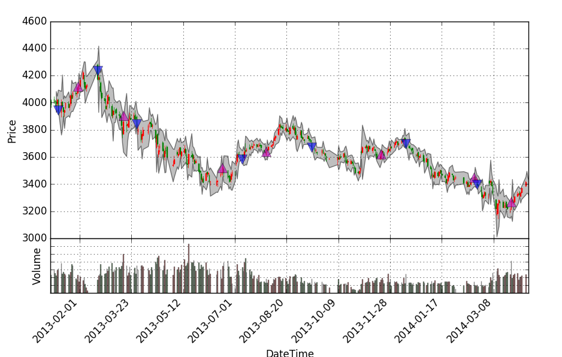

# XQuant

Backtesting microframe for equity/futures market with Python 3.x/pandas (兼容python 2.7).

A股市场股票、股指期货、商品期货的量化投资回测框架。当前版本：Version 0.3 (2016/09)

核心依赖库：

* Python 3.x/2.7 (建议3.x)
* Numpy
* Pandas
* Matplotlib

安装：直接下载或者git到本地，在Version 1.0前不使用pip安装途径。

使用：

API示例: 参考demo文件夹中的移动双均线策略（Moving Average Cross Strategy）

Changelog:

2016年11月--日，Version 0.4

* 回测引擎engine模块更加鲁棒和完善，支持滑点和手续费模型
* 兼容python 2.7并保持一段时间
* 持续完善finance/visual/utils，大幅增加utils模块

2016年9月22日，Version 0.3

* 创建finance模块：回测结果分析和策略评估、金融工具等
* 创建visual模块：可视化功能，包括回测分析和实时监控
* 创建utils模块：其他功能，如回测性能分析、并行计算、贝叶斯优化等

2016年9月11日，Version 0.2

* 完整的事件驱动引擎
* 双均线策略示例

注：非重要的子版本不列出，一般为Bugfix或者小的文本/注释调整

Copyright (c) 2016 X0Leon (Leon L. Zhang) Email: pku09zl[at]gmail.com

持续活跃更新中，在Version 1.0前不保证API稳定。欢迎讨论、PR和Star!

突破策略回测结果：

